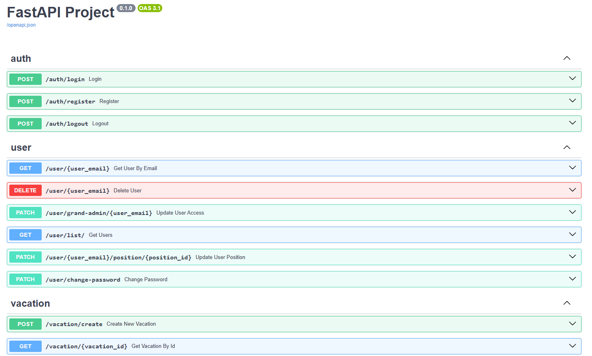

# 🚀 FastAPI Проект

Этот проект — учебное веб-приложение на FastAPI с PostgreSQL, Redis и SQLAlchemy.

## 📦 Стек технологий
- **FastAPI** — быстрый веб-фреймворк
- **PostgreSQL** — реляционная база данных
- **Redis** — хранение сессий
- **SQLAlchemy** — ORM для работы с базой данных  (асинхронное подключение через asyncpg)
- **Docker** — контейнеризация

## ⚙️ Установка и запуск

### 1. Клонирование репозитория
```bash
git clone https://github.com/wsdm777/python-fastapi.git
cd python-fastapi
```

### 2. Создание `.env` файла
Создай `.env` файл в корне проекта и добавь в него:
```ini
# Внешний порт PostgreSQL
DB_EXPOSED_PORT=5432
# Имя базы данных
DB_NAME=postgres
# Пользователь базы данных
DB_USER=postgres
# Пароль пользователя базы данных
DB_PASS=postgres
# Почта суперпользователя (используется при автоинициализации)
SUPERUSER_EMAIL="root@example.com"
# Пароль суперпользователя
SUPERUSER_PASSWORD="root"
# Внешний порт Redis
REDIS_EXPOSED_PORT=6379
# Количество воркеров для Uvicorn
UVICORN_WORKERS=2
```

### 3. Запуск с Docker
```bash
docker-compose up --build
```

## 📁 Структура проекта
```
python-fastapi/
 ├── alembic/        # Миграции Alembic
 ├── screenshots/    # Скриншоты Swagger Ui
 ├── src/            # Исходный код приложения
 │   ├── auth/       # Аутентификация и авторизация
 │   │   ├── router.py
 │   │   ├── schemas.py
 │   ├── position/   # Логика позиций
 │   │   ├── router.py
 │   │   ├── schemas.py
 │   ├── user/       # Логика пользователей
 │   │   ├── router.py
 │   │   ├── schemas.py
 │   ├── vacation/   # Логика отпусков
 │   │   ├── router.py
 │   │   ├── schemas.py
 │   ├── services/   # Redis
 │   │   ├── redis.py
 │   ├── utils/      # Утилиты
 │   │   ├── logger.py
 │   │   ├── create_superuser.py
 │   ├── database.py     # Подключение к БД
 │   ├── databasemodels.py # Определение моделей SQLAlchemy
 │   ├── main.py         # Главный файл FastAPI
 │   ├── config.py       # Конфигурация проекта
 ├── tests/           # Тесты
 ├── .dockerignore    # Игнорируемые файлы в Docker
 ├── .gitignore       # Игнорируемые файлы в Git
 ├── Dockerfile       # Конфигурация Docker
 ├── alembic.ini      # Конфигурация Alembic
 ├── docker-compose.yaml  # Конфигурация Docker Compose
 ├── entrypoint.sh    # Bash скрипт для Dockerfile
 ├── pytest.ini       # Конфигурация Pytest
 ├── redis.conf       # Конфигурация Redis
 ├── requirements.txt # Список зависимостей
```

## 📖 Документация API

Swagger UI доступен по адресу:

```
http://localhost:8000/docs
```

ReDoc доступен по адресу:

```
http://localhost:8000/redoc
```

### Swagger UI




## ✅ Тестирование
```bash
pytest
```

